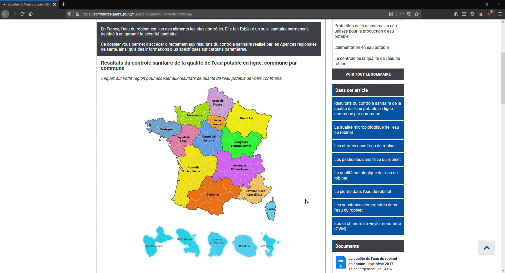

# FrenchWater

FrenchWater is an api written in python which helps you getting informations about the water near you

## Installation

With pip

```bash
pip install frenchwater
```

## Get your informations




## Usage

```python
from FrenchWater import FrenchWater

water = FrenchWater(region='93',departement='004',commune='04001',reseau='004001156_004')
water.get_last_results()
water.get_last_x_results(result_size=20)
```

## Contributing

Pull requests are welcome. For major changes, please open an issue first to discuss what you would like to change.

## License

[GNU GPLv3](https://choosealicense.com/licenses/gpl-3.0/)
